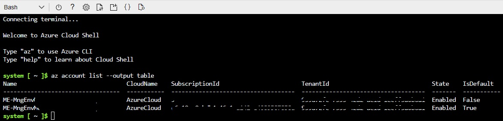
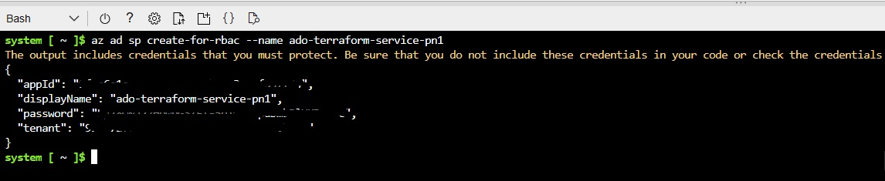
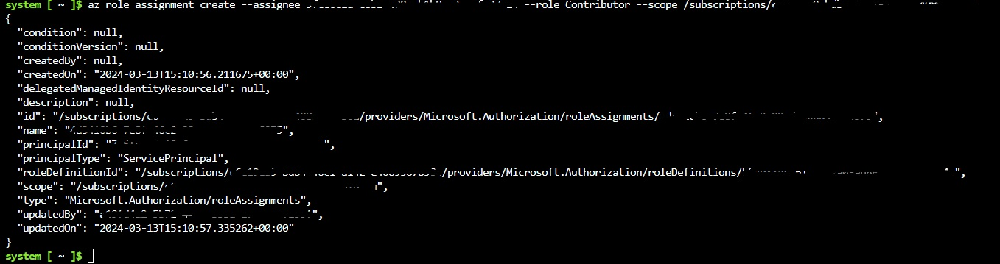
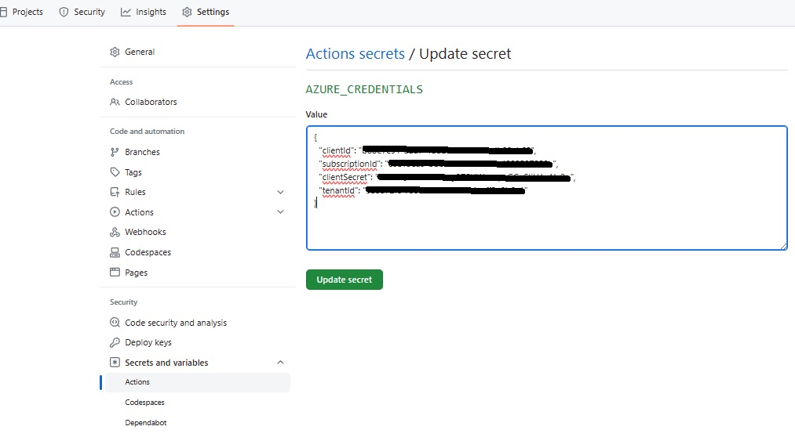

# ProjectIAC

ProjectIAC is an Infrastructure as Code (IaC) project that automates the process of setting up and deploying infrastructure in Azure using Terraform and GitHub Actions.

## Files in the Project

### mainTerra.tf

This is a Terraform configuration file located in the `InfrastructureAsCode` directory. It describes the resources that need to be created in Azure. This could include resources like virtual machines, databases, networking components, and more. Terraform uses this file to create, update, and delete resources in a way that matches the desired state described in the file.

### deployTerra.yml

This is a GitHub Actions workflow file located in the `.github/workflows` directory. It defines a set of actions that should be performed when certain events occur in the GitHub repository. In this case, the workflow is designed to deploy your infrastructure in Azure using Terraform. The workflow is triggered manually (`workflow_dispatch`), and it includes steps to log into Azure, set up Terraform, initialize Terraform, create a Terraform plan, and apply the Terraform plan.

### devcontainer.json

This is a configuration file for Visual Studio Code's Dev Containers, located in the `.devcontainer` directory. It specifies the Docker image to use for the development environment and any extensions that should be installed in the environment. In this case, it's set up to use the universal image from Microsoft and install the GitHub Copilot and GitHub Actions extensions.

## Prerequisites

- Azure account 
- GitHub account
- Terraform installed
- GitHub Codepsaces or Visual Studio Code 

## Usage

1. Fork the repository.
2. Create a Service Principal (see instructions below).
3. Set up repository secrets, under Settings tab, Security - Secrets and variables - Actions (see instructions below).
4. Execute the workflow under Actions tab, Workflows - Deploy with Terraform.
5. When the workflow is completed, check that the new resources are created in the Azure subscription. 


## Creating a Service Principal in Azure and Integrating it with GitHub Actions for Terraform Workflows 
To get the service principal (needed for Terraform – added to azure pipeline) 

### List your Azure subscriptions
To begin, you'll need to list all your Azure subscriptions to identify which one you want to use for your Terraform operations. Open your terminal or command prompt and use the Azure CLI to execute the following command:

```
az account list --output table
```
This command will display a table listing all your Azure subscriptions, including their names and subscription IDs.


### Set Your Active Subscription:
After identifying the subscription you wish to use from the list (and if you have multiple subscriptions), set it as your active subscription by replacing your-subscription-id with the actual subscription ID:
```
az account set --subscription your-subscription-id
```
This will configure your Azure CLI to use the specified subscription for subsequent commands.

### Create a Service Principal:
Next, create a service principal for Azure Resource Manager. This service principal will be used by Terraform to manage resources in your Azure subscription. Replace your-service-principal-name with a name you choose for your service principal:
```
az ad sp create-for-rbac --name your-service-principal-name
```
Example:
```
az ad sp create-for-rbac --name ado-terraform-service-pn
```
The command will output a JSON object containing the appId, displayName, password, and tenant. Note these down as you will need them later.


### Assign Role to Service Principal:
To grant the necessary permissions to your service principal, assign it a role. Typically, the "Contributor" role is sufficient for Terraform to manage resources. Replace [appId] with your service principal's appId and [Subscription ID] with your subscription ID:
```
az role assignment create --assignee [appId] --role Contributor --scope /subscriptions/[Subscription ID]
```


### Configure GitHub Actions:
To use the service principal within GitHub Actions, you need to create a secret that contains your Azure credentials. Format your credentials as follows, replacing placeholders with the actual values you obtained when creating the service principal:
```
{
  "clientId": "YOUR_APP_ID",
  "clientSecret": "YOUR_PASSWORD",
  "subscriptionId": "YOUR_SUBSCRIPTION_ID",
  "tenantId": "YOUR_TENANT_ID"
}
```
* clientId: This is the Application (client) ID of the service principal.
* clientSecret: The secret/password generated for your service principal.
* subscriptionId: The ID of the Azure subscription you're using.
* tenantId: The directory (tenant) ID.

### Add Azure Credentials to GitHub Repository Secrets:
* Navigate to your GitHub repository, go to Settings > Secrets.
* Click on 'New repository secret'.
* Name your secret AZURE_CREDENTIALS and paste the JSON credentials you formatted in the previous step.
* Click 'Add secret' to save it.
 
### Use Azure Credentials in GitHub Actions Workflow:
In your GitHub Actions workflow file, use the AZURE_CREDENTIALS secret to authenticate with Azure. Here is an example of how to set up the Azure login step in your workflow:

```
steps:
- uses: actions/checkout@v2

- name: Azure Login
  uses: azure/login@v1
  with:
    creds: ${{ secrets.AZURE_CREDENTIALS }}
```


After logging in, you can add subsequent steps in your workflow to execute Terraform commands or other Azure CLI commands to manage your Azure resources.

By following these steps, you've successfully created a service principal in Azure, assigned it the necessary permissions, and configured your GitHub Actions workflow to use these credentials to manage Azure resources through Terraform or other tools.

## Contributing

Contributions are welcome. Please open an issue or submit a pull request.